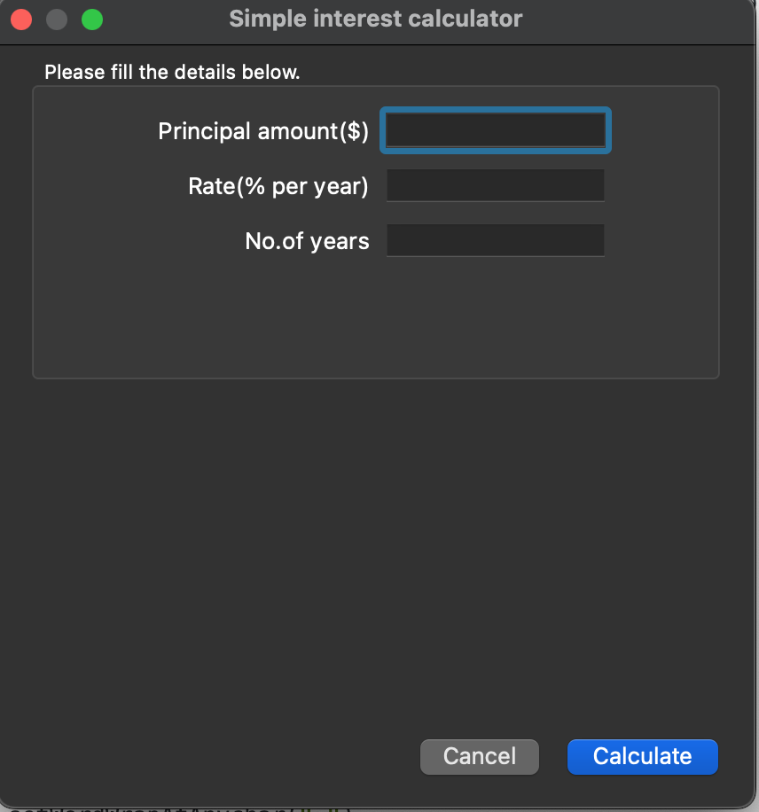
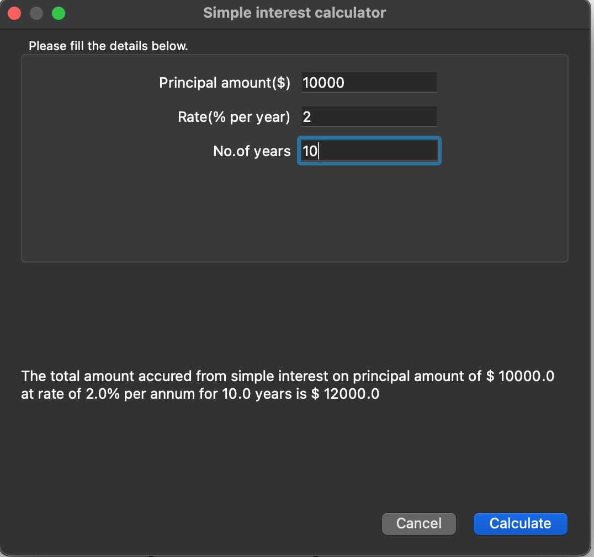

## Simple interest calculator

A python script which calculates the total accured amount using simple interest formula from principal, interest rate and time input. The python script is built using the **PyQt5** library.

#### Calculator app screens

#### Refer: 
https://www.guru99.com/pyqt-tutorial.html
